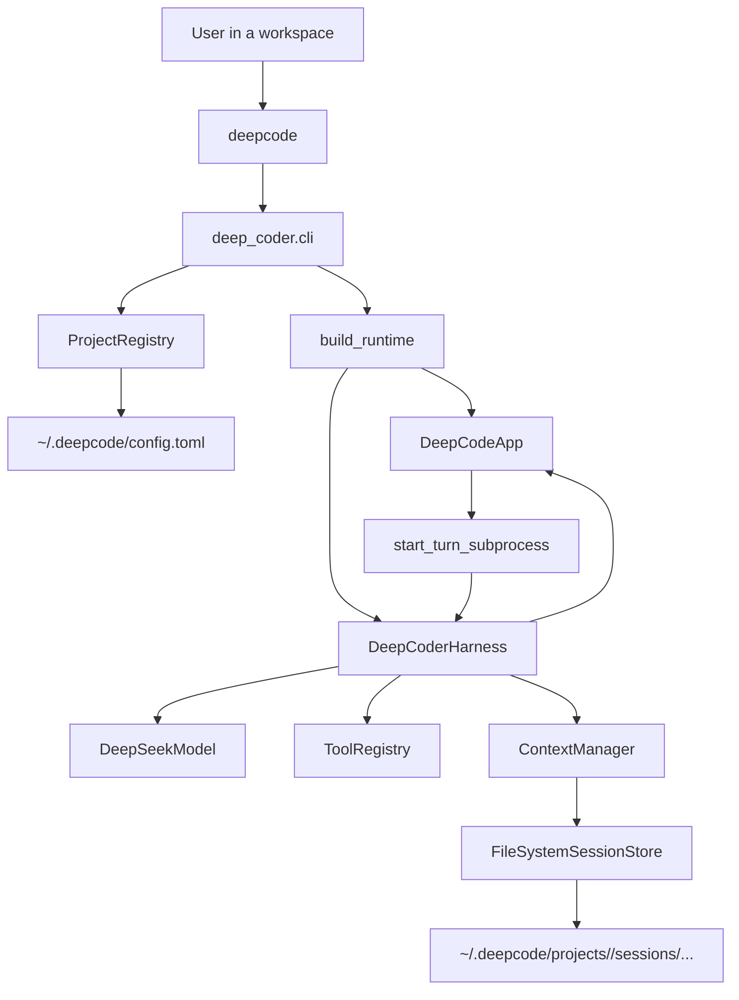

# Deep Coder

Deep Coder is a project-scoped terminal coding agent built around the DeepSeek API. It launches as a Textual TUI, keeps session history isolated per workspace, streams tool activity into a replayable timeline, and persists runtime state under `~/.deepcode/`.

The current product is the package-based runtime under `deep_coder/` plus the `deepcode` launcher. `agentLoop.py` remains in the repository as a legacy prototype and reference file, not the main entrypoint.

## Highlights

- Project-scoped sessions: each workspace resolves to a stable project record and its own persisted state root.
- Terminal-first workflow: one timeline, one composer, live event streaming, and replay of stored sessions.
- Local coding tools: bash, file read/write/edit, session task tools, and layered history search/load tools.
- Layered context: recent turns, persisted evidence, and summaries are assembled through the context layer instead of a flat transcript replay.
- DeepSeek-backed runtime: the model adapter uses the OpenAI-compatible Python SDK with DeepSeek as the current provider.

## Installation

### Install From Source As A Command

Clone the repository and install it into your user site-packages so `deepcode` is available on your shell `PATH`:

```bash
git clone <repository-url>
cd Deep-Coder
python3 -m pip install --user .
```

On many Linux systems this installs the command into `~/.local/bin`. If `deepcode` is not found after installation, add that directory to your `PATH`.

### Editable Install For Contributors

If you want an editable checkout for development:

```bash
git clone <repository-url>
cd Deep-Coder
python3 -m venv .venv
. .venv/bin/activate
python3 -m pip install -e ".[dev]"
```

That exposes `deepcode` inside the virtual environment and installs `pytest` for local verification.

### Required Environment

Deep Coder currently requires a DeepSeek API key:

```bash
export DEEPSEEK_API_KEY="your-api-key"
```

### Launcher Fallback

For repository-local development, the checked-in launcher script still works:

```bash
./deepcode
```

## Quick Start

1. Install Deep Coder from source.
2. Export `DEEPSEEK_API_KEY`.
3. `cd` into the workspace you want Deep Coder to operate on.
4. Run `deepcode`.
5. Type a request in the composer and press `Enter`.

Example:

```bash
cd /path/to/your/project
deepcode
```

Deep Coder will register the current workspace, create or reopen a project record, and keep that workspace's sessions under `~/.deepcode/projects/<project-key>/`.

## Architecture



### Module Overview

| Module | Responsibility |
| --- | --- |
| `deep_coder/cli.py` | Resolve the current workspace into a project and launch the TUI. |
| `deep_coder/main.py` | Build the runtime components: config, model, tools, prompt, context, and harness. |
| `deep_coder/tui/` | Render the timeline/composer UI, session switching, command palette, and live event updates. |
| `deep_coder/harness/` | Orchestrate a turn: assemble messages, call the model, execute tools, persist events, and stop on final assistant output. |
| `deep_coder/models/` | Wrap provider communication. The current implementation targets DeepSeek through the OpenAI-compatible SDK. |
| `deep_coder/tools/` | Expose tool schemas and local execution entrypoints for bash, files, tasks, and history retrieval. |
| `deep_coder/context/` | Persist sessions and assemble request context using the active context strategy. |
| `deep_coder/projects/` | Map a workspace path to a stable `project_key` and project-scoped state directory. |

### Runtime Flow

1. `deepcode` starts `deep_coder.cli:main`.
2. `ProjectRegistry` resolves the current working directory into a project record.
3. `build_runtime()` composes the DeepSeek model adapter, tool registry, prompt, context manager, and harness.
4. `DeepCodeApp` renders the timeline and composer.
5. Submitting from the composer starts a harness turn subprocess.
6. The harness prepares messages, calls the model, executes tool calls, records messages/events, and flushes session state.
7. The TUI streams those events into the timeline for both live viewing and later replay.

## User Manual

### Composer And Timeline

- Type normal text in the composer and press `Enter` to submit a prompt.
- Press `Shift+Enter` to insert a newline without submitting.
- The top pane shows persisted messages, tool calls, tool output, diffs, usage blocks, task snapshots, and interruption markers.

### Slash Commands

| Command | Behavior |
| --- | --- |
| `/history` | Show stored sessions for the active project. |
| `/session` | Start a new empty session in the current project. |
| `/model` | Select the active DeepSeek model, including `deepseek-chat` and `deepseek-reasoner` when available. |
| `/exit` | Close the TUI when the runtime is idle. |

Type `/` to open the command palette. `Tab` completes the selected command, and the arrow keys move the selection.

### Keyboard Shortcuts

| Shortcut | Action |
| --- | --- |
| `Ctrl+L` | Open the session switcher for the current project. |
| `Ctrl+J` | Focus the timeline pane. |
| `Ctrl+C` | Interrupt the active turn, or fall back to the app quit flow when no turn is running. |
| `Escape` | Leave timeline focus or cancel an active slash-command interaction. |

### Project Scope And State

Deep Coder is project-scoped. Launch it from the workspace you want to operate on.

Persistent state currently lives under:

```text
~/.deepcode/
  config.toml
  projects/
    <project-key>/
      sessions/
        <session-id>/
          meta.json
          messages.jsonl
          events.jsonl
          journal.jsonl
          evidence.jsonl
          summaries.jsonl
          artifacts.json
          context/
            <strategy-name>/
              state.json
```

The TUI only shows sessions for the active project. Model selection is stored globally in `~/.deepcode/config.toml`.

### Built-In Tool Surface

The current built-in tools are:

- `bash`
- `read_file`
- `write_file`
- `edit_file`
- `task_create`
- `task_update`
- `task_list`
- `task_get`
- `search_history`
- `load_history_artifacts`

File operations are workspace-bounded. The bash tool also blocks a small set of obviously dangerous command patterns.

## Development

The authoritative implementation lives under `deep_coder/` plus the checked-in `deepcode` launcher.

- Main launch path: `deep_coder/cli.py`
- Composition root: `deep_coder/main.py`
- Main TUI app: `deep_coder/tui/app.py`
- Main harness: `deep_coder/harness/deepcoder/harness.py`

Run the test suite with the project virtual environment:

```bash
/home/wys/Deep-Coder/.venv/bin/pytest -q
```

If you are modifying packaging or install behavior, also verify the editable install path:

```bash
/home/wys/Deep-Coder/.venv/bin/python -m pip install -e .
```
