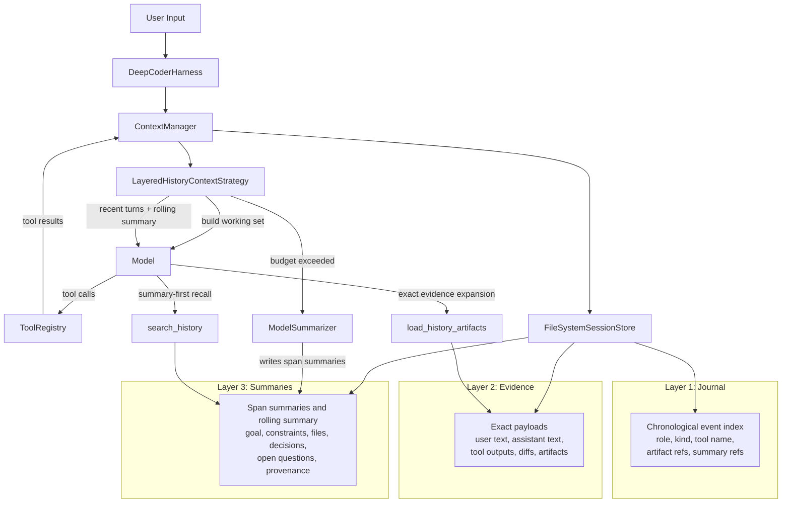

# Layered Context Storage Implementation Plan

> **For Claude:** REQUIRED SUB-SKILL: Use superpowers:executing-plans to implement this plan task-by-task.

**Goal:** Replace the current append-all message history with a layered context system that persists lightweight journal metadata, exact evidence payloads, and model-generated span summaries, then lets the runtime retrieve summary-first and expand raw evidence on demand.

**Architecture:** Keep the filesystem session store as the persistence boundary, but split session state into three layers: a journal for chronological event metadata, an evidence layer for exact user/assistant/tool payloads and artifact blobs, and a summary layer for structured summaries with provenance. Build prompts from system prompt + rolling summary + recent full turns, trigger compaction from the context strategy when token budgets are exceeded, and add retrieval tools so the model can ask for more history without reloading the full raw transcript.

**Tech Stack:** Python 3, pytest, Textual runtime, existing Deep Coder context / harness / tool modules, filesystem JSON/JSONL persistence

**Execution Notes:** Follow `@test-driven-development` and `@verification-before-completion`. Use `/home/wys/deep-code/.venv/bin/pytest -q` for verification in this repository. Before implementation, create a dedicated worktree under `.worktrees/`, for example `git worktree add -b feat/layered-context .worktrees/feat/layered-context HEAD`.

**Implementation Status (2026-03-27):** Tasks 1 through 7 are implemented on `feat/layered-context`. The runtime now persists journal, evidence, summaries, and artifacts; uses `LayeredHistoryContextStrategy` by default; triggers compaction from model usage; and exposes `search_history` plus `load_history_artifacts` for summary-first recall.
**Architecture Diagram:**



---

### Task 1: Add context budget config and layered record primitives

**Files:**
- Create: `deep_coder/context/records.py`
- Modify: `deep_coder/config.py`
- Modify: `tests/test_config.py`
- Create: `tests/context/test_records.py`

**Step 1: Write the failing tests**

```python
from deep_coder.config import RuntimeConfig
from deep_coder.context.records import (
    make_journal_entry,
    make_evidence_record,
    make_summary_record,
)


def test_runtime_config_exposes_layered_context_defaults(tmp_path, monkeypatch):
    monkeypatch.setenv("DEEPSEEK_API_KEY", "test-key")

    config = RuntimeConfig.from_env(workdir=tmp_path)

    assert config.context_recent_turns == 3
    assert config.context_working_token_budget > 0
    assert config.context_compact_threshold < config.context_working_token_budget


def test_record_helpers_capture_ids_and_provenance():
    journal = make_journal_entry(
        event_id="evt-1",
        turn_id="turn-1",
        kind="tool_result",
        role="tool",
        tool_name="read_file",
        artifact_ids=["art-1"],
    )
    evidence = make_evidence_record(
        evidence_id="evd-1",
        event_id="evt-1",
        role="tool",
        content="README contents",
    )
    summary = make_summary_record(
        summary_id="sum-1",
        covered_event_ids=["evt-1", "evt-2"],
        goal="inspect repository",
    )

    assert journal["artifact_ids"] == ["art-1"]
    assert evidence["event_id"] == "evt-1"
    assert summary["covered_event_ids"] == ["evt-1", "evt-2"]
```

**Step 2: Run tests to verify they fail**

Run: `/home/wys/deep-code/.venv/bin/pytest -q tests/test_config.py tests/context/test_records.py`

Expected: FAIL because the config has no layered-context budget fields and the record helper module does not exist.

**Step 3: Write the minimal implementation**

```python
@dataclass
class RuntimeConfig:
    ...
    context_recent_turns: int
    context_working_token_budget: int
    context_compact_threshold: int
    context_summary_max_tokens: int
```

```python
def make_journal_entry(...):
    return {
        "event_id": event_id,
        "turn_id": turn_id,
        "kind": kind,
        "role": role,
        "tool_name": tool_name,
        "artifact_ids": artifact_ids or [],
        "summary_ids": summary_ids or [],
    }
```

**Step 4: Run tests to verify they pass**

Run: `/home/wys/deep-code/.venv/bin/pytest -q tests/test_config.py tests/context/test_records.py`

Expected: PASS

**Step 5: Commit**

```bash
git add deep_coder/config.py deep_coder/context/records.py tests/test_config.py tests/context/test_records.py
git commit -m "feat: add layered context record primitives"
```

### Task 2: Persist journal, evidence, summaries, and legacy compatibility in the filesystem store

**Files:**
- Modify: `deep_coder/context/session.py`
- Modify: `deep_coder/context/stores/filesystem/store.py`
- Modify: `tests/context/test_filesystem_store.py`

**Step 1: Write the failing tests**

```python
from deep_coder.context.stores.filesystem.store import FileSystemSessionStore


def test_filesystem_store_persists_layered_context_state(tmp_path):
    store = FileSystemSessionStore(root=tmp_path)
    session = store.open()
    session.journal.append({"event_id": "evt-1", "kind": "user_message"})
    session.evidence.append({"evidence_id": "evd-1", "event_id": "evt-1", "content": "hello"})
    session.summaries.append({"summary_id": "sum-1", "covered_event_ids": ["evt-1"], "goal": "hello"})

    store.save(session)
    reopened = store.open(locator={"id": session.session_id})

    assert reopened.journal[0]["event_id"] == "evt-1"
    assert reopened.evidence[0]["evidence_id"] == "evd-1"
    assert reopened.summaries[0]["summary_id"] == "sum-1"


def test_filesystem_store_projects_legacy_messages_into_layered_records(tmp_path):
    session_dir = tmp_path / "sessions" / "session-a"
    session_dir.mkdir(parents=True)
    (session_dir / "meta.json").write_text('{"id": "session-a"}')
    (session_dir / "messages.jsonl").write_text('{"role":"user","content":"show tree"}\n')

    reopened = FileSystemSessionStore(root=tmp_path).open(locator={"id": "session-a"})

    assert reopened.journal[0]["kind"] == "user_message"
    assert reopened.evidence[0]["content"] == "show tree"
```

**Step 2: Run tests to verify they fail**

Run: `/home/wys/deep-code/.venv/bin/pytest -q tests/context/test_filesystem_store.py`

Expected: FAIL because the session model and filesystem store only know about `messages`, `events`, and strategy state.

**Step 3: Write the minimal implementation**

```python
@dataclass
class Session:
    ...
    journal: list[dict] = field(default_factory=list)
    evidence: list[dict] = field(default_factory=list)
    summaries: list[dict] = field(default_factory=list)
    artifacts: dict[str, dict] = field(default_factory=dict)
```

```python
_write_atomic_batch(
    {
        session_dir / "journal.jsonl": _dump_jsonl(session.journal),
        session_dir / "evidence.jsonl": _dump_jsonl(session.evidence),
        session_dir / "summaries.jsonl": _dump_jsonl(session.summaries),
        ...
    }
)
```

```python
if messages_path.exists() and not journal:
    journal, evidence = _project_legacy_messages(messages)
```

**Step 4: Run tests to verify they pass**

Run: `/home/wys/deep-code/.venv/bin/pytest -q tests/context/test_filesystem_store.py`

Expected: PASS

**Step 5: Commit**

```bash
git add deep_coder/context/session.py deep_coder/context/stores/filesystem/store.py tests/context/test_filesystem_store.py
git commit -m "feat: persist layered context state in filesystem store"
```

### Task 3: Refactor the context manager to record structured journal and evidence entries

**Files:**
- Modify: `deep_coder/context/manager.py`
- Modify: `deep_coder/context/strategies/base.py`
- Modify: `tests/context/test_simple_history_strategy.py`
- Create: `tests/context/test_layered_context_manager.py`

**Step 1: Write the failing tests**

```python
from deep_coder.context.manager import ContextManager
from deep_coder.context.session import Session


def test_context_manager_records_user_message_into_journal_and_evidence(tmp_path):
    manager = ContextManager(...)
    session = manager.open()

    manager.record_user_message(session, turn_id="turn-1", text="show files")

    assert session.journal[0]["kind"] == "user_message"
    assert session.evidence[0]["content"] == "show files"


def test_context_manager_records_tool_result_as_metadata_plus_artifact(tmp_path):
    manager = ContextManager(...)
    session = manager.open()

    manager.record_tool_result(
        session,
        turn_id="turn-1",
        tool_call_id="tool-1",
        tool_name="bash",
        arguments={"command": "tree ."},
        model_output="large output",
        output_text="large output",
    )

    assert session.journal[-1]["tool_name"] == "bash"
    assert session.journal[-1]["artifact_ids"]
    assert session.evidence[-1]["content"] == "large output"
```

**Step 2: Run tests to verify they fail**

Run: `/home/wys/deep-code/.venv/bin/pytest -q tests/context/test_simple_history_strategy.py tests/context/test_layered_context_manager.py`

Expected: FAIL because `ContextManager` only exposes the untyped `record_event()` pass-through.

**Step 3: Write the minimal implementation**

```python
class ContextManager:
    ...
    def record_user_message(self, session, turn_id: str, text: str) -> None: ...
    def record_assistant_message(self, session, turn_id: str, text: str, tool_calls=None) -> None: ...
    def record_tool_call(self, session, turn_id: str, tool_call: dict) -> None: ...
    def record_tool_result(self, session, turn_id: str, tool_call: dict, output) -> None: ...
    def record_summary(self, session, summary: dict) -> None: ...
```

```python
class ContextStrategyBase(ABC):
    ...
    def build_working_set(self, session, system_prompt: str, user_input: str | None) -> list[dict]:
        raise NotImplementedError
```

**Step 4: Run tests to verify they pass**

Run: `/home/wys/deep-code/.venv/bin/pytest -q tests/context/test_simple_history_strategy.py tests/context/test_layered_context_manager.py`

Expected: PASS

**Step 5: Commit**

```bash
git add deep_coder/context/manager.py deep_coder/context/strategies/base.py tests/context/test_simple_history_strategy.py tests/context/test_layered_context_manager.py
git commit -m "feat: add structured layered context recording APIs"
```

### Task 4: Implement model-driven rolling summaries and a layered history strategy

**Files:**
- Create: `deep_coder/context/summarizers/__init__.py`
- Create: `deep_coder/context/summarizers/base.py`
- Create: `deep_coder/context/summarizers/model.py`
- Create: `deep_coder/context/strategies/layered_history/__init__.py`
- Create: `deep_coder/context/strategies/layered_history/strategy.py`
- Modify: `deep_coder/main.py`
- Modify: `tests/test_main.py`
- Create: `tests/context/test_layered_history_strategy.py`

**Step 1: Write the failing tests**

```python
from deep_coder.context.session import Session
from deep_coder.context.strategies.layered_history.strategy import LayeredHistoryContextStrategy


def test_layered_strategy_builds_prompt_from_summary_plus_recent_turns(tmp_path):
    session = Session(session_id="s1", root=tmp_path)
    session.summaries = [
        {"summary_id": "sum-1", "covered_event_ids": ["evt-1"], "goal": "inspect repo", "open_questions": ["find app entrypoint"]}
    ]
    session.journal = [
        {"event_id": "evt-9", "turn_id": "turn-9", "kind": "assistant_message", "role": "assistant"},
        {"event_id": "evt-10", "turn_id": "turn-10", "kind": "user_message", "role": "user"},
    ]
    session.evidence = [
        {"evidence_id": "evd-9", "event_id": "evt-9", "role": "assistant", "content": "look at cli.py"},
        {"evidence_id": "evd-10", "event_id": "evt-10", "role": "user", "content": "continue"},
    ]

    strategy = LayeredHistoryContextStrategy(config=..., summarizer=FakeSummarizer())
    messages = strategy.prepare_messages(session, "system text", "next step")

    assert messages[0] == {"role": "system", "content": "system text"}
    assert "inspect repo" in messages[1]["content"]
    assert messages[-1] == {"role": "user", "content": "next step"}


def test_layered_strategy_compacts_old_spans_when_budget_is_exceeded(tmp_path):
    session = Session(session_id="s1", root=tmp_path)
    ...
    strategy = LayeredHistoryContextStrategy(config=..., summarizer=FakeSummarizer())

    compacted = strategy.maybe_compact(session, usage={"prompt_tokens": 9000})

    assert compacted is True
    assert session.summaries[-1]["covered_event_ids"]
```

**Step 2: Run tests to verify they fail**

Run: `/home/wys/deep-code/.venv/bin/pytest -q tests/context/test_layered_history_strategy.py tests/test_main.py`

Expected: FAIL because there is no layered strategy, no summarizer module, and `build_runtime()` still wires `SimpleHistoryContextStrategy`.

**Step 3: Write the minimal implementation**

```python
class SummarizerBase(ABC):
    @abstractmethod
    def summarize_span(self, session, entries: list[dict]) -> dict:
        raise NotImplementedError
```

```python
class LayeredHistoryContextStrategy(ContextStrategyBase):
    def prepare_messages(self, session, system_prompt: str, user_input: str) -> list[dict]:
        return [
            {"role": "system", "content": system_prompt},
            self._rolling_summary_message(session),
            *self._recent_turn_messages(session),
            {"role": "user", "content": user_input},
        ]
```

```python
context = ContextManager(
    store=FileSystemSessionStore(...),
    strategy=LayeredHistoryContextStrategy(
        config=config,
        summarizer=ModelSummarizer(model=model, config=config),
    ),
)
```

**Step 4: Run tests to verify they pass**

Run: `/home/wys/deep-code/.venv/bin/pytest -q tests/context/test_layered_history_strategy.py tests/test_main.py`

Expected: PASS

**Step 5: Commit**

```bash
git add deep_coder/context/summarizers deep_coder/context/strategies/layered_history deep_coder/main.py tests/context/test_layered_history_strategy.py tests/test_main.py
git commit -m "feat: add layered history strategy with rolling summaries"
```

### Task 5: Wire the harness into structured recording and automatic compaction

**Files:**
- Modify: `deep_coder/harness/deepcoder/harness.py`
- Modify: `tests/harness/test_deepcoder_harness.py`

**Step 1: Write the failing tests**

```python
def test_harness_records_tool_calls_and_results_into_layered_context(tmp_path):
    ...
    result = harness.run(session_locator=None, user_input="read README")
    reopened = context.open(locator={"id": result.session_id})

    assert reopened.journal[0]["kind"] == "user_message"
    assert reopened.journal[1]["kind"] == "assistant_tool_call"
    assert reopened.journal[2]["kind"] == "tool_result"
    assert reopened.evidence[-1]["content"] == "file contents"


def test_harness_triggers_compaction_after_large_prompt_usage(tmp_path):
    ...
    result = harness.run(None, "continue", event_sink=CapturingSink())

    assert any(event["type"] == "context_compacted" for event in events)
```

**Step 2: Run tests to verify they fail**

Run: `/home/wys/deep-code/.venv/bin/pytest -q tests/harness/test_deepcoder_harness.py`

Expected: FAIL because the harness only appends plain chat messages and never calls `maybe_compact()`.

**Step 3: Write the minimal implementation**

```python
while True:
    self.context.maybe_compact(session)
    messages = self.context.prepare_messages(session, system_prompt, current_input)
    ...
    self.context.record_user_message(session, turn_id=turn_id, text=current_input)
    ...
    self.context.record_assistant_message(session, turn_id=turn_id, text=response["content"] or "", tool_calls=response["tool_calls"])
    ...
    self.context.record_tool_result(session, turn_id=turn_id, tool_call=tool_call, output=output)
    ...
    if self.context.maybe_compact(session, usage=response["usage"]):
        self._publish(session, event_sink, self._event(session, turn_id, "context_compacted"))
```

**Step 4: Run tests to verify they pass**

Run: `/home/wys/deep-code/.venv/bin/pytest -q tests/harness/test_deepcoder_harness.py`

Expected: PASS

**Step 5: Commit**

```bash
git add deep_coder/harness/deepcoder/harness.py tests/harness/test_deepcoder_harness.py
git commit -m "feat: wire harness into layered context compaction"
```

### Task 6: Add summary-first history retrieval tools

**Files:**
- Create: `deep_coder/tools/history_search/__init__.py`
- Create: `deep_coder/tools/history_search/tool.py`
- Create: `deep_coder/tools/history_load/__init__.py`
- Create: `deep_coder/tools/history_load/tool.py`
- Modify: `deep_coder/tools/registry.py`
- Modify: `tests/tools/test_registry.py`
- Create: `tests/tools/test_history_tools.py`

**Step 1: Write the failing tests**

```python
from deep_coder.tools.registry import ToolRegistry


def test_registry_exposes_history_tools(tmp_path, monkeypatch):
    ...
    names = [schema["function"]["name"] for schema in registry.schemas()]
    assert "search_history" in names
    assert "load_history_artifacts" in names


def test_search_history_returns_summary_hits_before_raw_evidence(tmp_path, monkeypatch):
    ...
    result = registry.execute("search_history", {"query": "repo entrypoint"}, session=session)

    assert "sum-1" in result.model_output
    assert "cli.py" in result.model_output


def test_load_history_artifacts_returns_exact_evidence_payload(tmp_path, monkeypatch):
    ...
    result = registry.execute("load_history_artifacts", {"artifact_ids": ["art-1"]}, session=session)

    assert "tree ." in result.model_output
```

**Step 2: Run tests to verify they fail**

Run: `/home/wys/deep-code/.venv/bin/pytest -q tests/tools/test_registry.py tests/tools/test_history_tools.py`

Expected: FAIL because the history tools do not exist and the registry cannot expose them.

**Step 3: Write the minimal implementation**

```python
class HistorySearchTool(ToolBase):
    def exec(self, arguments: dict, session=None):
        hits = search_layered_history(session, query=arguments["query"])
        return render_search_hits(hits)
```

```python
class HistoryLoadTool(ToolBase):
    def exec(self, arguments: dict, session=None):
        payloads = load_artifacts(session, artifact_ids=arguments["artifact_ids"])
        return render_artifacts(payloads)
```

```python
return cls(
    [
        BashTool(...),
        ReadFileTool(...),
        ...,
        HistorySearchTool(config=config, workdir=workdir),
        HistoryLoadTool(config=config, workdir=workdir),
    ],
    workdir=workdir,
)
```

**Step 4: Run tests to verify they pass**

Run: `/home/wys/deep-code/.venv/bin/pytest -q tests/tools/test_registry.py tests/tools/test_history_tools.py`

Expected: PASS

**Step 5: Commit**

```bash
git add deep_coder/tools/history_search deep_coder/tools/history_load deep_coder/tools/registry.py tests/tools/test_registry.py tests/tools/test_history_tools.py
git commit -m "feat: add layered history retrieval tools"
```

### Task 7: Update architecture docs and run full verification

**Files:**
- Modify: `arch/arch.md`
- Modify: `docs/plans/2026-03-27-layered-context-storage.md`

**Step 1: Write the failing verification checklist**

```text
- Architecture doc still describes context as only session persistence + message assembly.
- No note explains the three-layer storage model or summary-first retrieval path.
- Full regression suite has not been run against the layered context changes.
```

**Step 2: Update docs**

Add the following details to `arch/arch.md`:

```markdown
The context layer persists three linked views of a session:
- journal metadata for chronological retrieval
- exact evidence payloads and artifact blobs
- structured summaries with provenance back to journal/evidence ids

Prompt assembly uses the rolling summary plus recent verbatim turns rather than the full raw transcript.
```

**Step 3: Run targeted verification**

Run: `/home/wys/deep-code/.venv/bin/pytest -q tests/context tests/harness/test_deepcoder_harness.py tests/tools/test_registry.py tests/tools/test_history_tools.py tests/test_main.py tests/test_config.py`

Expected: PASS

**Step 4: Run the full suite**

Run: `/home/wys/deep-code/.venv/bin/pytest -q`

Expected: PASS

**Step 5: Commit**

```bash
git add arch/arch.md docs/plans/2026-03-27-layered-context-storage.md
git commit -m "docs: document layered context architecture"
```
